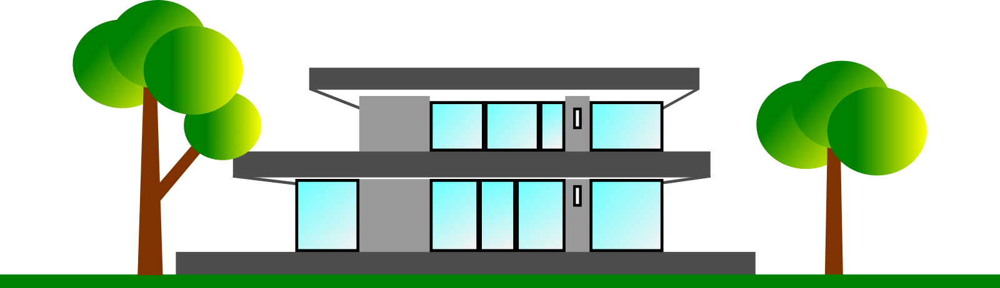

# Fjarholm Art

> *"In nature, nothing is lost. Death becomes the seed of something new."*

Fjarholm is an independent digital art portfolio inspired by Nordic nature and minimalist design. Through architectural sketches, vector illustrations, and pastel artworks, it explores the relationship between nature, structure, and quiet transformation.

Rather than pursuing complexity, Fjarholm seeks clarity. Every composition is guided by balance, restraint, and the timeless logic found in the natural world.

---

## The Philosophy

Fjarholm is shaped by raw northern nature — harsh, pure, and unadorned.

The work reflects quiet strength rather than spectacle. Storms reshape landscapes, branches bend without breaking, and every season transforms what came before. Nothing is wasted; every ending becomes the beginning of something new.

This philosophy extends beyond the artwork itself. Simplicity is not the absence of detail, but the careful removal of everything that is unnecessary.

---

## Artistic Direction

Fjarholm brings together three closely connected disciplines:

- **Architectural Sketches** — inspired by structure, proportion, and Nordic simplicity.
- **Vector Art** — clean geometric compositions built for precision and timeless scalability.
- **Pastel Art** — softer interpretations of nature, atmosphere, and seasonal change.

Together they form a coherent visual language rooted in nature, balance, and contemporary minimalism.

---

## Digital Craftsmanship

Behind every finished artwork is a structured digital workflow.

Vector illustrations are built from mathematical geometry, carefully constructed SVG paths, and scalable design principles. The technical documentation within this repository demonstrates how artistic ideas are translated into structured data while preserving clarity, precision, and long-term consistency.

---

  

---

  <b>Connect & Follow</b>  
  
  
  
  

---

## Official Destinations

🌐 **Official Website**  
https://fjarholm.com

🎨 **Extended Portfolio**  
https://sites.google.com/view/fjarholm-portfolio

🛠 **Technical Documentation**  
SVG Structure & Minimalist Logic  
./SVG-Concept.md

---

*Based in Northern Europe. Inspired by Nordic nature. Created through digital craftsmanship.*
